<div align="center">

# 🎬✨ Ghibli Studio App


### *Jelajahi dunia magis Studio Ghibli di genggaman Anda* 🌸

**Aplikasi Android yang menampilkan koleksi lengkap film, detail film, dan karakter dari Studio Ghibli dengan desain yang cantik dan responsif.**

[📥 Download APK](#) • [📖 Documentation](#) • [🐛 Report Bug](#) • [💡 Request Feature](#)

---

</div>

## 🌟 Highlight Features

<table>
<tr>
<td width="50%">

### 🎨 **Beautiful UI/UX**
- 🌞 Mode Terang yang cerah dan ceria
- 🌙 Mode Gelap yang elegan dan nyaman
- 🎭 Animasi smooth dengan Compose animations
- 📱 Responsive design dengan Compose Modifier
- ✨ Material 3 design system
- 🎨 Dynamic theming

</td>
<td width="50%">

### 🌐 **Multi-Language Support**
- 🇮🇩 Bahasa Indonesia
- 🇬🇧 English
- 📝 UI yang fully translated

</td>
</tr>
<tr>
<td width="50%">

### 🎬 **Complete Film Database**
- 📌 Dashboard dengan semua film Ghibli
- 🎞️ Detail informasi lengkap setiap film
- ⭐ Rating dan tahun rilis
- 📖 Synopsis dan trivia

</td>
<td width="50%">

### 👥 **Character Explorer**
- 👤 Daftar karakter dari setiap film
- 🎭 Detail karakter lengkap
- 🔍 Pencarian film & karakter
- 🎨 Avatar karakter berkualitas tinggi

</td>
</tr>
</table>

---

## 📸 Screenshots Gallery

### 🌞 Light Mode - Tampilan yang Cerah & Ceria

<div align="center">

| 🏠 Home Screen | 📌 Film Dashboard | 🎬 Film Details |
|:---:|:---:|:---:|
| 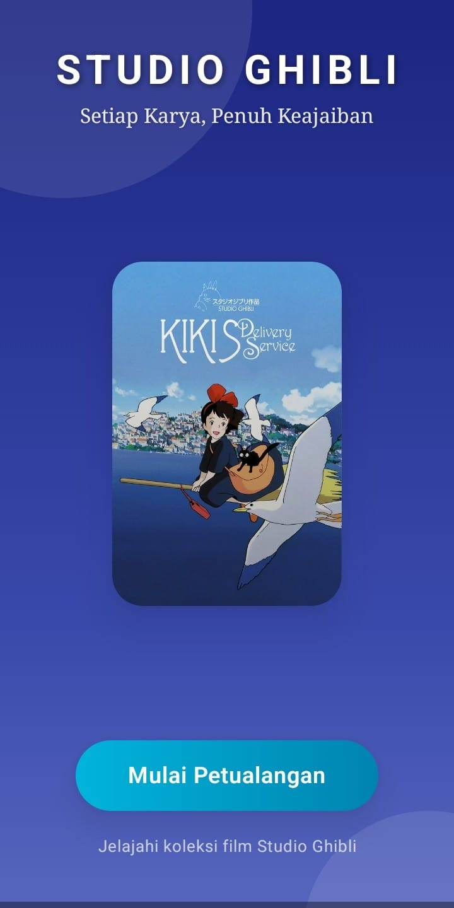 | 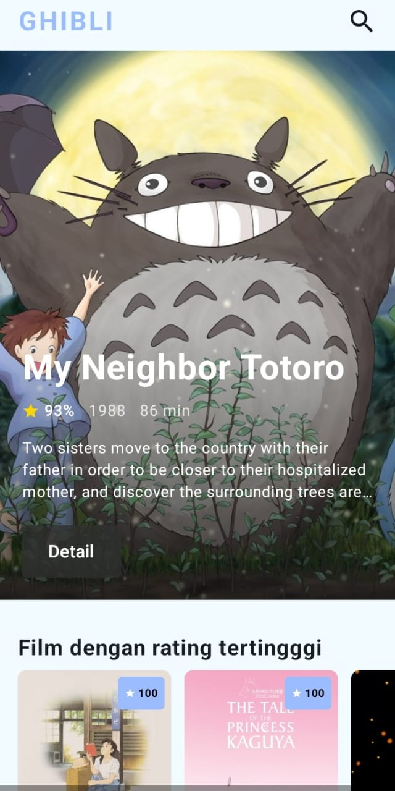 | 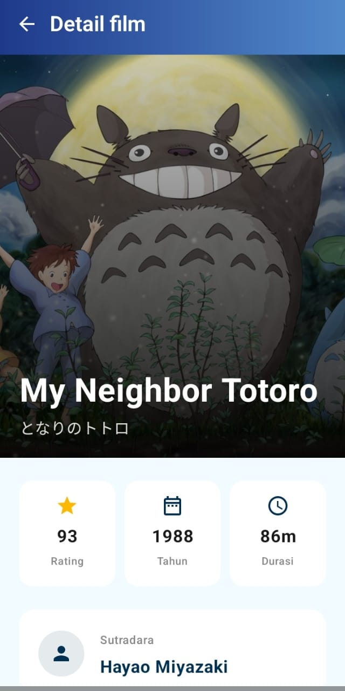 |

| 📜 Dashboard Mid | 📝 Dashboard End | 👤 Characters |
|:---:|:---:|:---:|
|  | 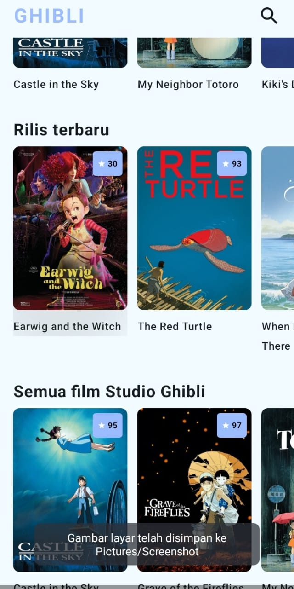 | 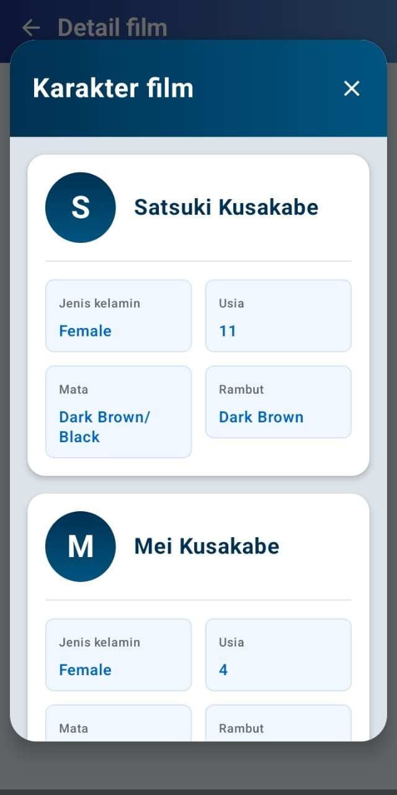 |

| 🎞️ Film Details Mid | 🔍 Search Feature |
|:---:|:---:|
| 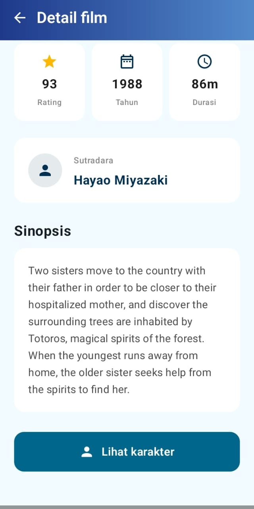 | 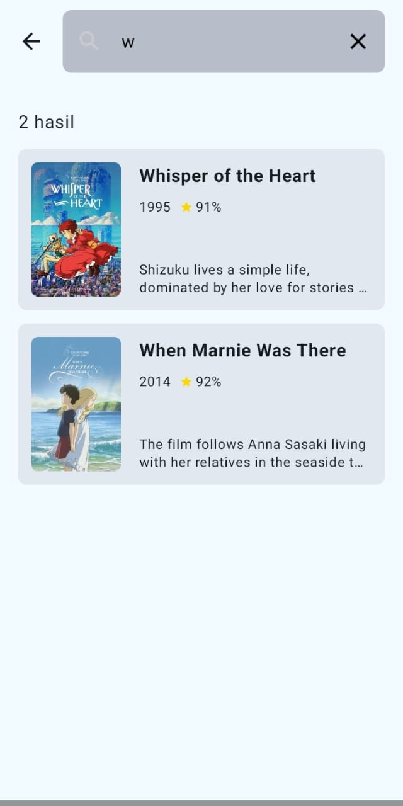 |

</div>

---

### 🌙 Dark Mode - Tampilan yang Elegan & Nyaman

<div align="center">

| 🏠 Home Screen | 📌 Film Dashboard | 🎬 Film Details |
|:---:|:---:|:---:|
|  | 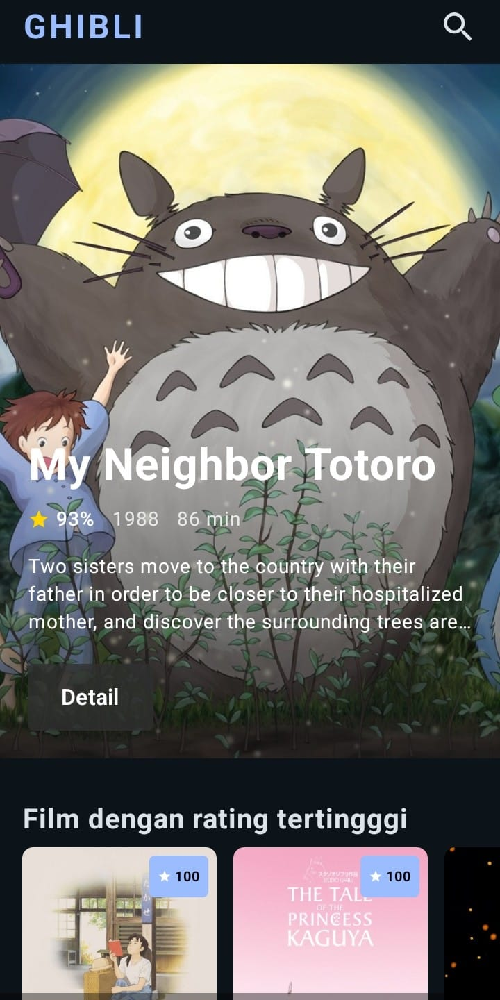 | 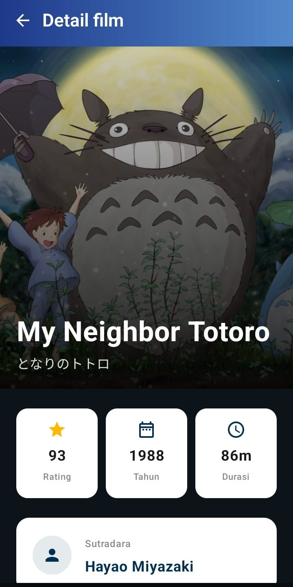 |

| 📜 Dashboard Mid | 📝 Dashboard End | 👤 Characters |
|:---:|:---:|:---:|
| 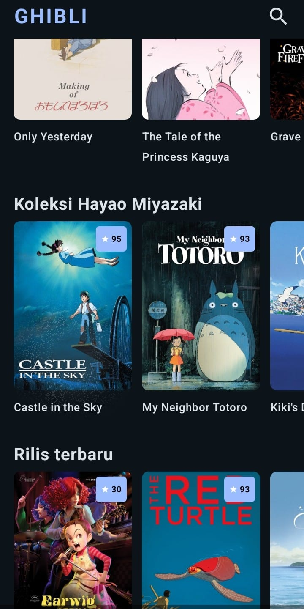 | 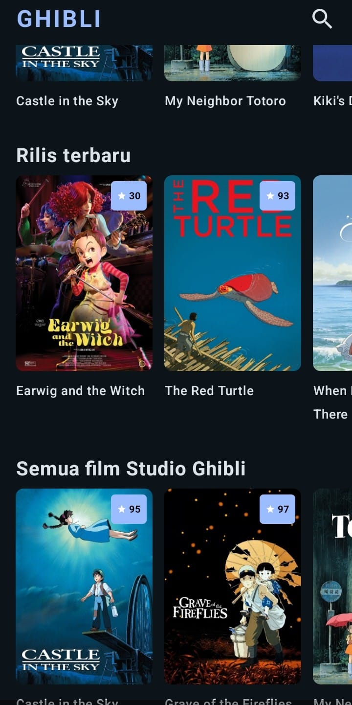 | 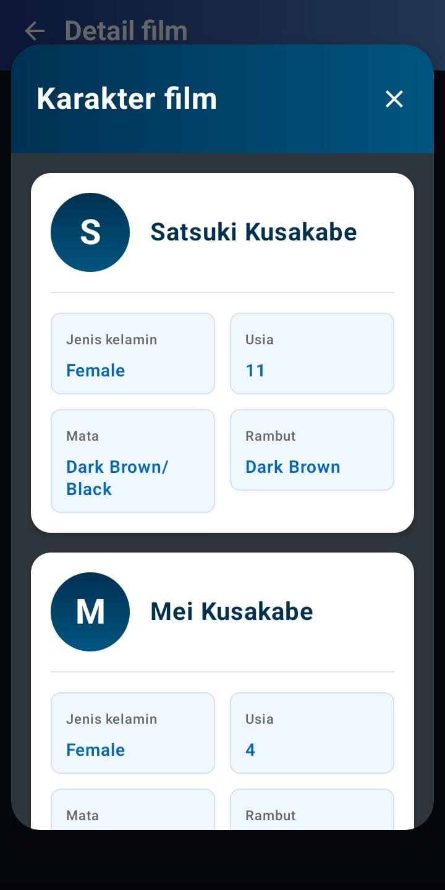 |

| 🎞️ Film Details Mid | 🔍 Search Feature |
|:---:|:---:|
| 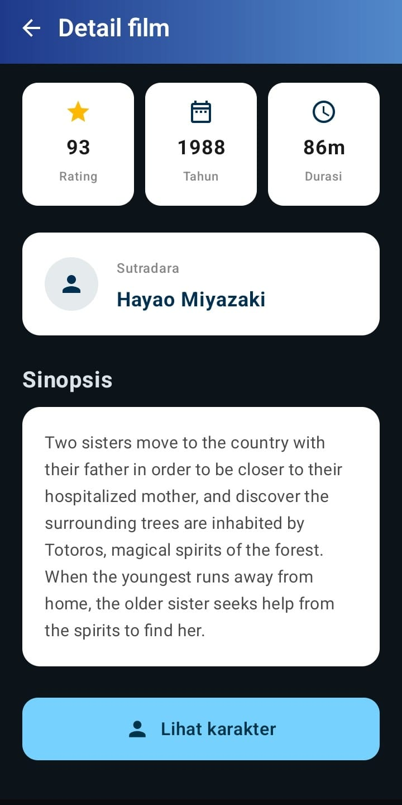 | 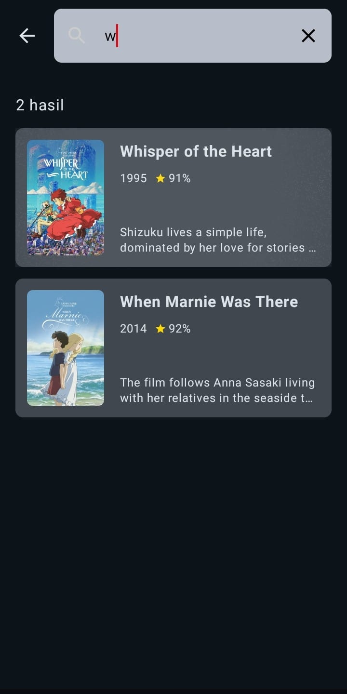 |

</div>

---

## 🛠️ Tech Stack

<div align="center">

| Category | Technologies |
|:---:|:---|
| **Language** |  |
| **Architecture** |   |
| **UI** |   |
| **Networking** |   |
| **Image Loading** |  |
| **Async** |   |
| **Dependency Injection** |  |
| **Navigation** |  |
| **API Source** |  |

</div>

---

## 🚀 Getting Started

### Prerequisites

```bash
- Android Studio Hedgehog atau lebih baru (untuk Compose support)
- JDK 17 atau lebih tinggi
- Android SDK API Level 24+ (Android 7.0)
- Kotlin 1.9.0+
- Koneksi internet untuk mengakses API
```

### Installation

1. **Clone repository ini**
   ```bash
   git clone https://github.com/username/ghibli-app.git
   ```

2. **Buka project di Android Studio**
   ```bash
   cd ghibli-app
   ```

3. **Sync Gradle dan jalankan aplikasi**
   - Klik `Sync Project with Gradle Files`
   - Pilih emulator atau device fisik
   - Klik tombol `Run` ▶️

---

## 📦 Project Structure

```
app/
├── 📁 data/
│   ├── 📁 api/          # Retrofit API interfaces
│   ├── 📁 model/        # Data models
│   └── 📁 repository/   # Repository implementations
├── 📁 domain/
│   ├── 📁 model/        # Domain models
│   └── 📁 usecase/      # Business logic use cases
├── 📁 ui/
│   ├── 📁 theme/        # Compose theme (Color, Typography, Shape)
│   ├── 📁 components/   # Reusable Composables
│   ├── 📁 screens/
│   │   ├── 📁 home/     # HomeScreen composable
│   │   ├── 📁 dashboard/# DashboardScreen composable
│   │   ├── 📁 detail/   # DetailScreen composables
│   │   └── 📁 search/   # SearchScreen composable
│   └── 📁 navigation/   # Navigation graph
├── 📁 di/               # Dependency Injection modules
└── 📁 utils/            # Utility classes & extensions
```

---

## 🎯 Key Features Breakdown

### 🏠 Home Screen
- Splash screen dengan animasi Jetpack Compose
- Animated logo Studio Ghibli dengan fade & scale effects
- Smooth navigation transitions
- Material 3 design components

### 📌 Film Dashboard
- LazyVerticalGrid untuk performa optimal
- Animated item appearances
- Shimmer loading effect dengan Compose
- Pull-to-refresh dengan accompanist library
- Shared element transitions

### 🎬 Film Details
- Parallax scrolling effect
- Collapsing toolbar dengan Compose
- Animated content loading
- Hero image transitions
- Bottom sheet untuk karakter details
- Share functionality dengan system integration

### 👤 Character Details
- Custom animated card components
- Fade-in animations untuk avatar
- Smooth expand/collapse animations
- Material 3 bottom sheets

### 🔍 Search Feature
- Real-time search dengan debounce
- Animated search bar expansion
- Filter chips dengan Compose
- Search results dengan fade-in animations
- Empty state illustrations

---

## 🎨 Design Philosophy

> *"Terinspirasi dari estetika film-film Studio Ghibli yang penuh dengan warna, kehangatan, dan keajaiban"*

- **Material 3**: Design system terbaru dari Google dengan dynamic color
- **Warna**: Palet warna yang lembut dan hangat, terinspirasi dari film Ghibli
- **Typography**: Material 3 typography dengan custom font families
- **Spacing**: Consistent spacing menggunakan Compose Modifier
- **Animation**: Smooth transitions dengan Compose Animation API
  - `animateContentSize()` untuk perubahan ukuran yang smooth
  - `AnimatedVisibility` untuk enter/exit animations
  - `Crossfade` untuk transisi konten
  - Shared element transitions antar screen

---

## 💡 Compose Highlights

### 🎯 **State Management**
```kotlin
// ViewModel dengan StateFlow
@HiltViewModel
class FilmViewModel @Inject constructor(
    private val repository: GhibliRepository
) : ViewModel() {
    private val _uiState = MutableStateFlow<UiState>(UiState.Loading)
    val uiState: StateFlow<UiState> = _uiState.asStateFlow()
}
```

### 🎨 **Custom Composables**
- `GhibliCard()` - Reusable card component
- `GhibliTopAppBar()` - Custom top bar dengan animations
- `LoadingShimmer()` - Skeleton loading effect
- `EmptyState()` - Illustrated empty states
- `ErrorState()` - Error handling UI

### 🔄 **Side Effects**
- `LaunchedEffect` untuk API calls
- `DisposableEffect` untuk cleanup
- `derivedStateOf` untuk computed states
- `rememberCoroutineScope` untuk manual coroutine launches

---

## 🤝 Contributing

Kontribusi sangat diterima! Jika Anda ingin berkontribusi:

1. Fork repository ini
2. Buat branch fitur baru (`git checkout -b feature/AmazingFeature`)
3. Commit perubahan Anda (`git commit -m 'Add some AmazingFeature'`)
4. Push ke branch (`git push origin feature/AmazingFeature`)
5. Buat Pull Request

---

## 📄 License

Distributed under the MIT License. See `LICENSE` for more information.

---

## 👨‍💻 Developer

<div align="center">

**Dibuat dengan ❤️ dan ☕ oleh Karina Salsabilla**

[](https://github.com/yourusername)
[](https://linkedin.com/in/yourusername)
[](mailto:your.email@example.com)

</div>

---

## 🙏 Acknowledgments

- [Studio Ghibli API](https://ghibliapi.herokuapp.com/) untuk menyediakan data film
- Studio Ghibli untuk film-film yang menginspirasi

---

<div align="center">

### ⭐ Jika project ini bermanfaat, jangan lupa berikan bintang! ⭐

**Made with 💚 for all Ghibli fans around the world**

</div>
